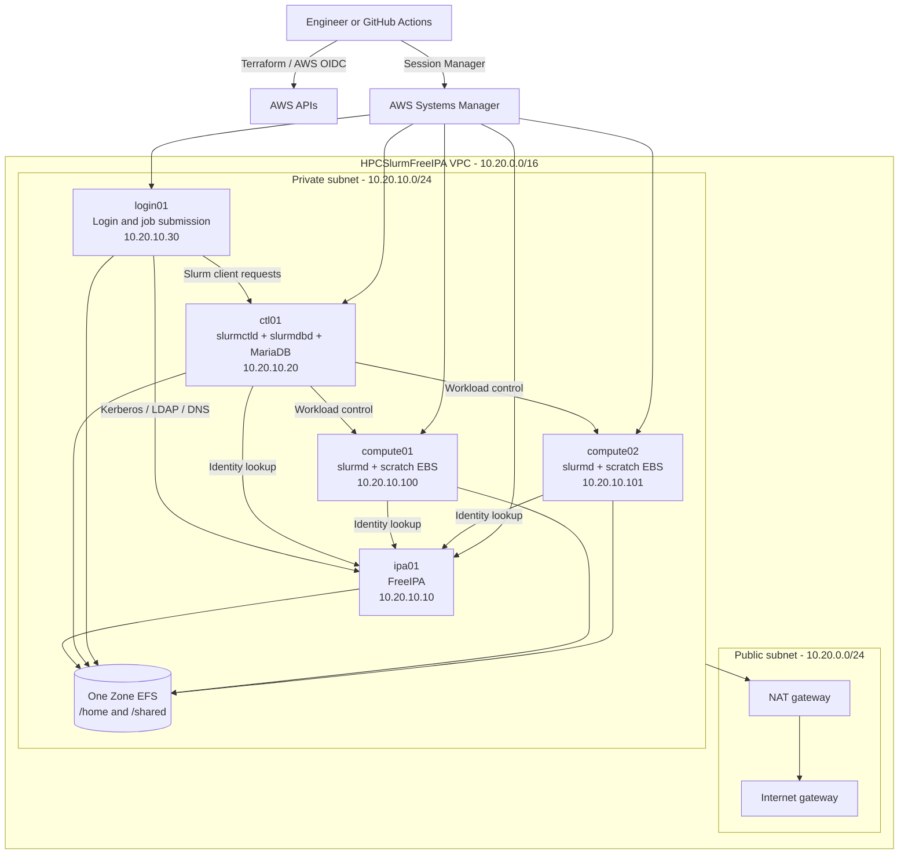

# HPCSlurmFreeIPA

An automated AWS HPC lab that combines FreeIPA centralized identity with Slurm
workload scheduling. Terraform provisions the infrastructure, Ansible configures
the cluster services, and GitHub Actions will provide validation and controlled
deployment through AWS OIDC.

> **Current milestone:** Terraform infrastructure and the Ansible base,
> FreeIPA server, client enrollment, and identity roles are implemented and pass
> syntax validation. AWS runtime validation is still pending. Shared storage is
> the next Ansible development phase.

## Overview

This project demonstrates the infrastructure and Linux systems engineering
needed to build a small but complete HPC environment:

- Private AWS networking with controlled outbound access
- Centralized users, groups, Kerberos, LDAP, DNS, and SSSD through FreeIPA
- Slurm controller, compute execution, login access, and job accounting
- Shared POSIX storage through Amazon EFS
- Per-compute-node EBS scratch storage
- Tag-driven Ansible dynamic inventory
- Private administration through AWS Systems Manager
- GitHub Actions authentication to AWS without long-lived access keys

The lab is intentionally compact—one FreeIPA server, one controller, one login
node, and two compute nodes—so it can be deployed temporarily, demonstrated,
and destroyed to control cost.

## Project status

Status values: **Complete**, **In progress**, **Planned**, and **Deferred**.

| Phase                | Status      | Completion requirement                                             | Evidence                        |
| -------------------- | ----------- | ------------------------------------------------------------------ | ------------------------------- |
| Terraform backend    | Complete    | Separate S3 state and locking for persistent and disposable roots  | `terraform validate`            |
| IAM and GitHub OIDC  | In progress | Apply the `HPCSlurmFreeIPA` rename and verify role assumption      | Identity plan reviewed          |
| Network              | Complete    | VPC, subnets, NAT, IGW, routes, and outputs implemented            | Terraform validation            |
| Security groups      | Complete    | FreeIPA, Slurm, EFS, and `srun` rules implemented                  | Terraform validation            |
| Storage              | Complete    | EFS access points and compute scratch EBS implemented              | Terraform validation            |
| EC2 nodes            | Complete    | Five private nodes, IMDSv2, encryption, SSM bootstrap              | Terraform validation            |
| Secrets metadata     | Complete    | Empty secret containers and least-privilege IAM access             | No values in state              |
| AWS deployment       | Planned     | Apply infrastructure and confirm five SSM-managed nodes            | Add deployment evidence         |
| Ansible base         | In progress | Dynamic inventory and common role implemented; run against AWS     | Syntax check passed             |
| FreeIPA              | In progress | Server, clients, identities, and sudo policy coded; run against AWS | Syntax check passed             |
| Shared storage       | Planned     | EFS and scratch mounts configured idempotently                     | Add mount evidence              |
| Slurm and accounting | Planned     | MUNGE, MariaDB, SlurmDBD, controller, login, and compute working   | Add Slurm evidence              |
| End-to-end demo      | Planned     | FreeIPA user submits and tracks a multi-node job                   | Add job output                  |
| GitHub Actions       | Planned     | CI, reviewed deployment, validation, and teardown workflows        | Add workflow link               |
| CloudWatch           | Deferred    | Not part of the current scope                                      | —                               |

## Architecture



## Component inventory

### Nodes

| Node        | Role       | Private IP     | Default size | Planned services                        |
| ----------- | ---------- | -------------- | ------------ | --------------------------------------- |
| `ipa01`     | FreeIPA    | `10.20.10.10`  | `t3.medium`  | FreeIPA, Kerberos, LDAP, DNS, CA        |
| `ctl01`     | Controller | `10.20.10.20`  | `t3.medium`  | `slurmctld`, `slurmdbd`, MariaDB, MUNGE |
| `login01`   | Login      | `10.20.10.30`  | `t3.small`   | SSSD, MUNGE, Slurm client tools         |
| `compute01` | Compute    | `10.20.10.100` | `t3.small`   | SSSD, MUNGE, `slurmd`                   |
| `compute02` | Compute    | `10.20.10.101` | `t3.small`   | SSSD, MUNGE, `slurmd`                   |

All nodes use the pinned Rocky Linux 9 AMI
`ami-07f1ef003bc5de2b1` in `us-east-1`, owned by Rocky Linux account
`792107900819`.

### Storage

| Storage                    | Scope         | Intended mount | Purpose                                            |
| -------------------------- | ------------- | -------------- | -------------------------------------------------- |
| Encrypted EFS access point | Cluster       | `/home`        | Shared FreeIPA user home directories               |
| Encrypted EFS access point | Cluster       | `/shared`      | Shared applications, data, scripts, and job output |
| Encrypted gp3 root EBS     | Every node    | `/`            | Operating system and installed services            |
| Encrypted gp3 scratch EBS  | Compute nodes | `/scratch`     | Node-local temporary job data                      |

Terraform attaches compute scratch volumes as `/dev/sdf`. Ansible must locate
the corresponding NVMe device by EBS volume identity rather than assuming the
guest device name remains `/dev/sdf`.

### Network and service ports

| Destination | Source          | Ports           | Purpose                           |
| ----------- | --------------- | --------------- | --------------------------------- |
| FreeIPA     | Cluster clients | TCP/UDP 53      | DNS                               |
| FreeIPA     | Cluster clients | TCP 80, 443     | Enrollment, API, web interface    |
| FreeIPA     | Cluster clients | TCP/UDP 88      | Kerberos authentication           |
| FreeIPA     | Cluster clients | TCP 389, 636    | LDAP and LDAPS                    |
| FreeIPA     | Cluster clients | TCP/UDP 464     | Kerberos password service         |
| Controller  | Cluster clients | TCP 6817        | Slurm controller                  |
| Compute     | Controller      | TCP 6818        | Slurm daemon control              |
| Controller  | Cluster clients | TCP 6819        | SlurmDBD accounting               |
| Login       | Compute         | TCP 60001-60010 | Interactive `srun` return traffic |
| EFS         | Cluster clients | TCP 2049        | NFSv4.1                           |

No instance receives a public IP address or internet-facing SSH rule.
Administration uses AWS Systems Manager.

## Identity and scheduling flow

FreeIPA and Slurm solve different parts of authentication and authorization:

1. A user authenticates on `login01` through PAM and SSSD backed by FreeIPA.
2. SSSD resolves the user's POSIX UID, GID, groups, and home directory.
3. The user runs `sbatch`, `srun`, `squeue`, or `sacct` on the login node.
4. MUNGE signs Slurm credentials exchanged between Slurm components.
5. `slurmctld` allocates one or more compute nodes.
6. `slurmd` resolves the same user identity and launches the process under the
   correct UID and GID.
7. EFS presents the same home directory and shared data on all required nodes.
8. SlurmDBD records the job in MariaDB for later inspection with `sacct`.

FreeIPA does not replace MUNGE. MUNGE authenticates Slurm messages; FreeIPA
provides the human user's centralized identity.

## Repository structure

```text
.
├── README.md
├── ARCHITECTURE.md
├── terraform/
│   ├── providers.tf
│   ├── variables.tf
│   ├── locals.tf
│   ├── main.tf
│   ├── outputs.tf
│   ├── terraform.tfvars.example
│   ├── identity/
│   │   ├── providers.tf
│   │   ├── variables.tf
│   │   ├── locals.tf
│   │   ├── main.tf
│   │   ├── outputs.tf
│   │   └── terraform.tfvars.example
│   └── modules/
│       ├── network/
│       ├── security/
│       ├── storage/
│       ├── ec2_node/
│       ├── iam/
│       ├── secrets/
│       └── ansible_transfer/
└── ansible/
    ├── inventory/
    ├── group_vars/
    ├── playbooks/
    └── roles/
```

Documentation ownership:

- Architecture decisions: `ARCHITECTURE.md`
- Terraform usage: `terraform/README.md`
- Persistent identity usage: `terraform/identity/README.md`
- Ansible usage: `ansible/README.md`

## Terraform design

### State boundaries

| Root                 | State key                                          | Lifecycle  | Main resources                                  |
| -------------------- | -------------------------------------------------- | ---------- | ----------------------------------------------- |
| `terraform/identity` | `slurm-cluster-freeipa/identity/terraform.tfstate` | Persistent | IAM, profiles, OIDC role, secret containers     |
| `terraform`          | `slurm-cluster-freeipa/dev/terraform.tfstate`      | Disposable | Network, EC2, storage, security, transfer bucket |

The backend retains its existing lowercase path to avoid an unnecessary state
migration. There is no Terraform `environment` variable or `Environment` AWS
tag.

### Tag-driven discovery

Common tags:

```text
Project   = HPCSlurmFreeIPA
Owner     = mohamed-atef
ManagedBy = terraform
```

EC2 discovery tags:

```text
NodeName       = ipa01 | ctl01 | login01 | compute01 | compute02
Role           = freeipa | controller | login | compute
AnsibleManaged = true
```

The Ansible AWS inventory plugin uses these tags to discover running nodes and
build the `freeipa`, `controller`, `login`, and `compute` groups without a
static inventory file. It also builds the composite `freeipa_clients` and
`slurm_nodes` groups.

### Ansible SSM transfer bucket

The disposable Terraform root creates a private, encrypted S3 bucket used by
the `amazon.aws.aws_ssm` connection plugin to transfer Ansible modules. Public
access is blocked, abandoned objects expire after one day, and the bucket is
removed with the disposable infrastructure.

Terraform exports both values required by automation:

```text
ansible_transfer_bucket_name
ansible_transfer_bucket_arn
```

GitHub Actions will read `ansible_transfer_bucket_name` after `terraform apply`
and pass it to Ansible as `ansible_aws_ssm_bucket_name`. The generated bucket
name is account- and Region-specific and is not hard-coded in Ansible.

### Secrets

Terraform creates empty metadata containers only:

```text
HPCSlurmFreeIPA/freeipa/credentials
HPCSlurmFreeIPA/slurm/munge
HPCSlurmFreeIPA/slurm/database
```

Expected JSON schemas:

```json
{"admin_password": "...", "directory_manager_password": "..."}
```

```json
{"munge_key_base64": "..."}
```

```json
{"database_name": "slurm_acct_db", "username": "slurm", "password": "..."}
```

Values are populated outside Terraform so they never enter Terraform state.
Node roles receive only the secrets required by that role. Sensitive Ansible
tasks must use `no_log: true`.

Secret deletion has no recovery window. Removing a container from Terraform
causes immediate, unrecoverable deletion.

## Deployment

### Prerequisites

- Terraform `>= 1.10.0, < 2.0.0`
- AWS provider `~> 6.61`
- AWS CLI credentials authorized to manage the identity root
- Ansible Core and the Python dependencies in `ansible/requirements.txt`
- The Ansible collections in `ansible/requirements.yml`
- The Session Manager plugin for the `amazon.aws.aws_ssm` connection
- Existing encrypted S3 backend bucket
- Existing GitHub Actions OIDC provider in the AWS account
- Access to `us-east-1` and sufficient service quotas

### 1. Apply persistent identity

```bash
cp terraform/identity/terraform.tfvars.example terraform/identity/terraform.tfvars
terraform -chdir=terraform/identity init -reconfigure
terraform -chdir=terraform/identity fmt -recursive
terraform -chdir=terraform/identity validate
terraform -chdir=terraform/identity plan -out=identity.tfplan
terraform -chdir=terraform/identity apply identity.tfplan
```

The current identity state uses the former lowercase prefix. Review the plan
carefully: changing to `HPCSlurmFreeIPA` replaces existing IAM names and secret
containers. Copy any required secret values before applying.

### 2. Populate secret values

Populate values either from the AWS Secrets Manager console or from encrypted
GitHub Actions environment/repository secrets after Terraform creates the
containers. A deployment workflow may call `aws secretsmanager put-secret-value`
and then let the FreeIPA instance retrieve the value through its IAM role.
Never place plaintext values in Terraform variables, `.tfvars`, workflow YAML,
logs, or committed files.

### 3. Apply disposable infrastructure

```bash
cp terraform/terraform.tfvars.example terraform/terraform.tfvars
terraform -chdir=terraform init -reconfigure
terraform -chdir=terraform fmt -recursive
terraform -chdir=terraform validate
terraform -chdir=terraform plan -out=cluster.tfplan
terraform -chdir=terraform apply cluster.tfplan
```

### 4. Confirm private-node management

```bash
aws ssm describe-instance-information \
  --region us-east-1 \
  --query 'InstanceInformationList[*].[InstanceId,PingStatus,PlatformName]' \
  --output table
```

Do not start application configuration until all expected instances report
`Online`.

### 5. Run the implemented Ansible roles

```bash
python3 -m pip install -r ansible/requirements.txt
ansible-galaxy collection install -r ansible/requirements.yml

ANSIBLE_TRANSFER_BUCKET="$(
  terraform -chdir=terraform output -raw ansible_transfer_bucket_name
)"

cd ansible
ansible-inventory --graph
ansible-playbook --syntax-check playbooks/site.yml
ansible-playbook \
  -e "ansible_aws_ssm_bucket_name=${ANSIBLE_TRANSFER_BUCKET}" \
  playbooks/site.yml
```

Populate the FreeIPA credentials secret before running the playbook. Detailed
Ansible behavior and identity operations are documented in
[`ansible/README.md`](ansible/README.md).

## Ansible implementation status

```text
ansible/
├── README.md
├── ansible.cfg
├── requirements.yml
├── inventory/
│   └── cluster.aws_ec2.yml
├── group_vars/
│   ├── all.yml
│   ├── freeipa.yml
│   ├── controller.yml
│   ├── login.yml
│   └── compute.yml
├── playbooks/
│   ├── site.yml
│   └── validate.yml
└── roles/
    ├── common/
    ├── freeipa_server/
    ├── freeipa_client/
    ├── freeipa_identity/
    ├── storage_client/
    ├── scratch_storage/
    ├── munge/
    ├── mariadb/
    ├── slurmdbd/
    ├── slurm_common/
    ├── slurm_controller/
    ├── slurm_login/
    └── slurm_compute/
```

Implemented behavior:

1. Tag-driven dynamic AWS inventory and role-based groups.
2. SSM connections to private instances with no inbound SSH requirement.
3. Rocky Linux 9 base packages, FQDN hostnames, UTC, Amazon Time Sync, AWS CLI,
   and temporary `/etc/hosts` bootstrap resolution.
4. Non-interactive FreeIPA installation for `cluster.internal`, with integrated
   DNS forwarding to the VPC resolver and credentials retrieved locally from
   Secrets Manager by the FreeIPA instance role.
5. Client DNS configuration, one-time-password enrollment, automatic home
   directory support, host keytab validation, and SSSD domain validation.
6. FreeIPA `hpc_users` and `hpc_admins` groups, demonstration users, and a
   centralized full-sudo rule for members of `hpc_admins`.

The storage, MUNGE, database, and Slurm roles currently remain the next
implementation stages.

When each role is completed, update the project-status table and add its
validation result to the next section.

## Validation and demonstration evidence

Replace each pending result with sanitized evidence when that milestone passes.

| Test                 | Expected result                            | Current result | Evidence              |
| -------------------- | ------------------------------------------ | -------------- | --------------------- |
| Terraform formatting | Both roots pass recursive formatting       | Passed         | Add CI link later     |
| Terraform validation | Both roots are valid                       | Passed         | Local validation      |
| Infrastructure plan  | Includes the private S3 transfer bucket     | Pending re-plan | Add plan summary      |
| SSM registration     | Five nodes report `Online`                 | Pending        | Add screenshot/output |
| Dynamic inventory    | Five hosts grouped by `Role`               | Pending        | Add inventory graph   |
| FreeIPA health       | IPA services healthy                       | Pending        | Add `ipactl status`   |
| Kerberos             | Test user receives a ticket                | Pending        | Add `klist` output    |
| Central identity     | Same UID/GID on login and compute          | Pending        | Add `id` output       |
| EFS mounts           | `/home` and `/shared` mounted              | Pending        | Add `findmnt` output  |
| Compute scratch      | `/scratch` mounted on both compute nodes   | Pending        | Add `findmnt` output  |
| MUNGE                | Credential validates across nodes          | Pending        | Add MUNGE output      |
| Slurm nodes          | Both compute nodes are `IDLE`              | Pending        | Add `sinfo` output    |
| Batch job            | FreeIPA user job completes                 | Pending        | Add `sbatch` output   |
| Multi-node execution | `srun hostname` reaches both compute nodes | Pending        | Add job output        |
| Accounting           | Completed job appears in `sacct`           | Pending        | Add accounting output |

### Final demonstration job

```bash
#!/bin/bash
#SBATCH --job-name=cluster-test
#SBATCH --nodes=2
#SBATCH --output=/shared/cluster-test-%j.out

id
hostname
date
srun hostname
```

## CI/CD roadmap

| Workflow      | Trigger               | Responsibility                                   | Status  |
| ------------- | --------------------- | ------------------------------------------------ | ------- |
| `ci.yml`      | Pull request and push | Terraform checks, Ansible syntax and lint        | Planned |
| `deploy.yml`  | Manual approval       | OIDC login, apply, SSM wait, Ansible, validation | Planned |
| `destroy.yml` | Manual approval       | Destroy disposable root only                     | Planned |

The deployment role still needs narrowly scoped SSM control-plane permissions
before a GitHub-hosted workflow can execute remote configuration.

## Teardown and cost control

```bash
terraform -chdir=terraform plan -destroy -out=destroy.tfplan
terraform -chdir=terraform apply destroy.tfplan
```

This removes the VPC, NAT gateway, EC2 instances, EFS, root volumes, and
compute scratch volumes. The persistent identity root and backend remain.

Primary cost drivers are NAT gateway uptime, EC2 running hours, EBS storage,
EFS data, and active Secrets Manager containers. Stopping EC2 does not stop the
other charges; destroy the disposable root when the lab is not needed.
