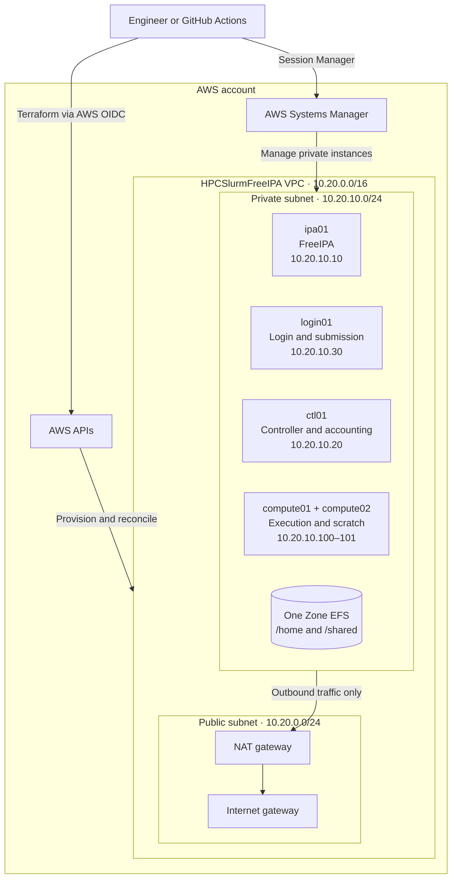
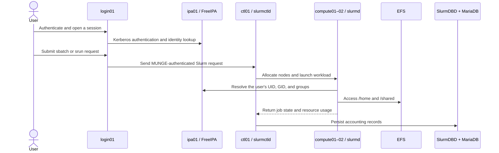

# AWS HPC Cluster Automation

Infrastructure as Code for a private, identity-aware Slurm cluster on AWS.
Terraform builds the cloud foundation, Ansible configures the operating system
and cluster services, FreeIPA provides centralized Linux identity, and MUNGE
secures communication between Slurm components.

The environment is intentionally compact—one identity server, one controller,
one login node, and two compute nodes—so it can demonstrate production-minded
HPC patterns without the cost of a large permanent cluster.

## What this project demonstrates

- Private EC2 nodes with no public IP addresses or inbound SSH
- Administration through AWS Systems Manager Session Manager
- Tag-driven dynamic Ansible inventory over the SSM connection plugin
- Centralized users, groups, sudo policy, Kerberos, LDAP, DNS, and SSSD
- Shared `/home` and `/shared` filesystems backed by encrypted Amazon EFS
- Encrypted gp3 scratch storage mounted independently on each compute node
- Shared MUNGE authentication with key material delivered from Secrets Manager
- Slurm controller, compute daemons, login client, and per-job scratch lifecycle
- SlurmDBD accounting backed by controller-local MariaDB
- Separate persistent and disposable Terraform state boundaries
- Role-separated IAM and an OIDC trust model for GitHub Actions

## Technology stack

| Layer                | Technologies                                                      |
| -------------------- | ----------------------------------------------------------------- |
| Cloud platform       | AWS EC2, VPC, IAM, EFS, EBS, S3, Systems Manager, Secrets Manager |
| Infrastructure       | Terraform, AWS provider, remote S3 state and locking              |
| Configuration        | Ansible, `amazon.aws`, `ansible.posix`, `ansible.mysql`           |
| Operating system     | Rocky Linux 9, systemd, Chrony, XFS                               |
| Identity             | FreeIPA, Kerberos, LDAP, DNS, SSSD                                |
| Scheduling and trust | Slurm, SlurmDBD, MUNGE                                            |
| Accounting           | MariaDB with InnoDB                                               |
| Delivery model       | GitHub Actions with AWS OIDC                                      |

## Architecture

### Deployment topology

The deployment view deliberately shows only infrastructure and management
boundaries. Service traffic is shown separately below so that operational and
runtime paths do not overlap.



### Workload and identity flow



### Node roles

| Node        | Responsibility                 | Default size | Primary services                      |
| ----------- | ------------------------------ | ------------ | ------------------------------------- |
| `ipa01`     | Identity and DNS               | `t3.medium`  | FreeIPA, Kerberos, LDAP, DNS, CA      |
| `ctl01`     | Scheduling and accounting      | `t3.medium`  | `slurmctld`, SlurmDBD, MariaDB, MUNGE |
| `login01`   | User access and job submission | `t3.small`   | SSSD, MUNGE, Slurm client tools       |
| `compute01` | Workload execution             | `t3.small`   | `slurmd`, MUNGE, local XFS scratch    |
| `compute02` | Workload execution             | `t3.small`   | `slurmd`, MUNGE, local XFS scratch    |

### Network policy

Security groups authorize traffic by workload role rather than by broad CIDR
rules. The shared cluster-client group is attached only to nodes that need
FreeIPA, Slurm, or EFS services.

| Destination   | Authorized source | Ports           | Purpose                           |
| ------------- | ----------------- | --------------- | --------------------------------- |
| FreeIPA       | Cluster clients   | TCP/UDP 53      | Integrated DNS                    |
| FreeIPA       | Cluster clients   | TCP 80, 443     | Enrollment, API, and web services |
| FreeIPA       | Cluster clients   | TCP/UDP 88      | Kerberos authentication           |
| FreeIPA       | Cluster clients   | TCP 389, 636    | LDAP and LDAPS                    |
| FreeIPA       | Cluster clients   | TCP/UDP 464     | Kerberos password service         |
| Controller    | Cluster clients   | TCP 6817        | Slurm controller RPC              |
| Compute nodes | Controller        | TCP 6818        | `slurmd` control traffic          |
| Controller    | Cluster clients   | TCP 6819        | SlurmDBD accounting RPC           |
| Login node    | Compute nodes     | TCP 60001–60010 | Interactive `srun` return traffic |
| EFS           | Cluster clients   | TCP 2049        | NFSv4.1 mounts                    |

MariaDB listens only on controller loopback and is not exposed through an AWS
security-group rule. No node accepts internet-facing SSH.

## Design decisions

### Private administration

All EC2 instances live in the private subnet. Session Manager replaces inbound
SSH, while the NAT gateway provides controlled outbound access for operating
system packages and AWS service endpoints. The Ansible inventory discovers
running instances from Terraform-managed EC2 tags and connects through SSM.

### Identity and Slurm authentication

FreeIPA and MUNGE solve different trust problems:

- FreeIPA supplies human identity, POSIX attributes, group membership, sudo
  policy, Kerberos authentication, LDAP, DNS, and SSSD integration.
- MUNGE signs credentials exchanged by Slurm components. Every Slurm node uses
  the same protected key, retrieved through its own EC2 instance role.

Maintaining consistent UIDs and GIDs across login, controller, and compute
nodes allows Slurm to launch workloads under the correct user identity.

### Storage model

| Storage                    | Scope            | Mount      | Purpose                                     |
| -------------------------- | ---------------- | ---------- | ------------------------------------------- |
| Encrypted EFS access point | Cluster-wide     | `/home`    | Shared FreeIPA home directories             |
| Encrypted EFS access point | Cluster-wide     | `/shared`  | Applications, data, scripts, and job output |
| Encrypted gp3 root EBS     | Per node         | `/`        | Operating system and services               |
| Encrypted gp3 scratch EBS  | Per compute node | `/scratch` | Temporary high-throughput job data          |

Compute disks are selected by EBS volume identity rather than assumed Linux
device names. Ansible formats only blank disks, mounts XFS by UUID, and refuses
devices containing unexpected filesystem, RAID, or partition signatures.

### Terraform state boundaries

| Root                 | Lifecycle  | Responsibility                                                                |
| -------------------- | ---------- | ----------------------------------------------------------------------------- |
| `terraform/identity` | Persistent | EC2 roles, instance profiles, secret containers, and GitHub OIDC permissions  |
| `terraform`          | Disposable | Network, EC2, EFS, EBS, security groups, NAT, and the Ansible transfer bucket |

This separation allows the lab infrastructure to be destroyed for cost control
without removing long-lived identities, secret containers, or deployment
permissions.

## Automation workflow

### Terraform provisioning

The persistent identity root is applied first. It establishes EC2 roles and
instance profiles, Secrets Manager containers, and the short-lived GitHub OIDC
deployment role. The disposable root reads those persistent outputs and creates
the VPC, subnets, NAT gateway, security groups, EC2 instances, EFS access
points, compute scratch volumes, and the temporary Ansible transfer bucket.

Every managed EC2 instance receives consistent discovery tags:

| Tag              | Example           | Use                                             |
| ---------------- | ----------------- | ----------------------------------------------- |
| `Project`        | `HPCSlurmFreeIPA` | Restricts inventory discovery to this project   |
| `ManagedBy`      | `terraform`       | Distinguishes Terraform-managed instances       |
| `AnsibleManaged` | `true`            | Opts the instance into configuration management |
| `Role`           | `controller`      | Creates the primary Ansible inventory group     |
| `NodeName`       | `ctl01`           | Supplies the inventory hostname and final FQDN  |

Terraform also exports the S3 transfer-bucket name and EFS identifiers needed
at Ansible runtime. These values are infrastructure metadata, not secrets.

### Dynamic inventory and SSM transport

The `amazon.aws.aws_ec2` inventory plugin discovers running instances and
builds the following groups without a static host file:

- `freeipa`, `controller`, `login`, and `compute` from the EC2 `Role` tag
- `freeipa_clients` from controller, login, and compute nodes
- `slurm_nodes` from controller, login, and compute nodes

Each inventory hostname maps to its EC2 instance ID. Ansible uses
`amazon.aws.aws_ssm` instead of SSH and transfers modules through a dedicated,
encrypted S3 bucket. Transfer objects expire automatically after one day, and
the bucket is deleted with the disposable stack.

### Configuration order

The main playbook deliberately configures dependencies before their consumers:

1. Apply the Rocky Linux baseline, hostname, time synchronization, and shared
   utilities to every node.
2. Install FreeIPA and create centralized groups, users, and sudo policy.
3. Enroll controller, login, and compute nodes as FreeIPA clients.
4. Mount the EFS access points and prepare compute-local scratch storage.
5. Install the shared MUNGE trust domain on all Slurm nodes.
6. Install the shared Slurm packages and inventory-derived `slurm.conf` on all
   Slurm nodes.
7. Prepare MariaDB, then start SlurmDBD and `slurmctld` on the controller.
8. Install the prolog and epilog scripts, then start `slurmd` on compute nodes.
9. Install the login-node example job after the compute partition is configured.

This sequencing prevents Slurm services from starting before DNS, identity,
clock synchronization, shared authentication, and accounting storage are ready.

## Service configuration

### Operating-system baseline

The common role standardizes Rocky Linux 9 nodes before application services
are installed. It configures UTC, assigns each Terraform `NodeName` as a
cluster FQDN, installs shared administration tools, and points Chrony at the
Amazon Time Sync Service (`169.254.169.123`). Temporary managed `/etc/hosts`
entries support deterministic bootstrap resolution before FreeIPA DNS is fully
available.

### FreeIPA server and identities

`ipa01.cluster.internal` provides the `CLUSTER.INTERNAL` Kerberos realm and
integrated DNS. The server is installed non-interactively with credentials
retrieved locally from Secrets Manager. External DNS requests are forwarded to
the VPC resolver.

The identity role creates two demonstration access levels:

| Identity   | Membership                | Intended access                    |
| ---------- | ------------------------- | ---------------------------------- |
| `hpcuser`  | `hpc_users`               | Standard cluster user              |
| `hpcadmin` | `hpc_users`, `hpc_admins` | Cluster user with centralized sudo |

Administrative operations use an isolated temporary Kerberos credential cache
that is destroyed on both success and failure. Initial user passwords are set
out of band and are never committed to the repository.

### FreeIPA clients

Controller, login, and compute nodes configure FreeIPA DNS with the VPC resolver
as a fallback, install SSSD and automatic home-directory support, and enroll
non-interactively. One-time enrollment passwords are created on `ipa01`, so the
FreeIPA administrator credential is never granted to client instance roles.

### Shared and local storage

The storage-client role mounts encrypted EFS access points persistently with
TLS. `/shared` is owned by `root:hpc_users` with setgid permissions so new files
inherit the collaboration group.

For `/scratch`, Ansible correlates Terraform's EBS volume ID with the NVMe
serial presented by EC2. It does not assume that `/dev/sdf` remains the Linux
device name. A disk is formatted only when it is blank; existing unexpected
signatures cause the role to stop rather than overwrite data.

### MUNGE trust domain

The MUNGE role installs the service on the controller, login, and compute
nodes. Each host retrieves the same base64-encoded key using its instance role,
decodes it into a protected temporary file, and atomically replaces
`/etc/munge/munge.key` only when the content changes. The key is owned by
`munge:munge` with mode `0600`, and a change triggers a controlled service
restart.

The role performs a local encode/decode test; the validation playbook separately
proves that a controller-generated credential can be decoded across the Slurm
node group.

### MariaDB accounting storage

MariaDB runs only on `ctl01` and binds to `127.0.0.1`. A dedicated configuration
fragment applies a case-insensitive UTF-8 collation and lab-sized InnoDB tuning,
including a 512 MiB buffer pool, 128 MiB log file, 900-second lock timeout, and
16 MiB maximum packet size.

The controller retrieves the database secret through its instance role. Ansible
creates the accounting database and a `localhost` application user with full
privileges only on that database. Administrative operations use MariaDB's local
Unix socket; no database-root password or remote database administration path
is introduced.

### Slurm scheduling and accounting

The shared Slurm role installs the pinned EPEL 9 package release, creates the
controller and daemon state directories, and renders one `slurm.conf` from the
dynamic EC2 inventory. Compute CPU counts, private addresses, and usable memory
are derived from gathered host facts rather than duplicated in static files.

On `ctl01`, SlurmDBD connects to the local MariaDB database, registers the
cluster with `sacctmgr`, and starts before `slurmctld`. Compute nodes install a
prolog that creates `/scratch/$SLURM_JOB_ID` for the submitting UID and GID and
an epilog that removes only that validated numeric job directory. The login
role installs `/shared/examples/hostname.sbatch`; it runs after the compute role
so its example targets an already configured partition.

These roles are implemented and pass local parsing and template-rendering
checks. Their service startup, node registration, job execution, and accounting
path have not yet been proven on deployed Rocky Linux instances.

## Secret handling

Terraform creates secret containers but never stores secret values in state.
The protected deployment workflow generates the FreeIPA administrator,
Directory Manager, MUNGE, and MariaDB values. Its dedicated bootstrap role
writes them directly to AWS Secrets Manager. Authorized EC2 roles retrieve them
locally, and sensitive Ansible operations suppress output with `no_log`.

Required Secrets Manager names:

```text
HPCSlurmFreeIPA/freeipa/credentials
HPCSlurmFreeIPA/slurm/munge
HPCSlurmFreeIPA/slurm/database
```

Expected JSON values:

```json
{"admin_password": "...", "directory_manager_password": "..."}
```

```json
{"munge_key_base64": "..."}
```

```json
{"database_name": "slurm_acct_db", "username": "slurm", "password": "..."}
```

Secret access is limited by node role:

| EC2 role   | Readable secrets                         |
| ---------- | ---------------------------------------- |
| FreeIPA    | FreeIPA bootstrap credentials            |
| Controller | MUNGE key and Slurm database credentials |
| Login      | MUNGE key                                |
| Compute    | MUNGE key                                |

The GitHub secret-bootstrap role may list versions and add values to these
three containers, but it cannot retrieve their contents. The normal deployment
role cannot read or change them.

The expected JSON schemas and rotation considerations are documented in
[`ansible/README.md`](ansible/README.md).

### Credentials an operator may need

Only the human login credential `HPCUSER_INITIAL_PASSWORD` is supplied as a
protected GitHub environment secret. It is never passed to Terraform or written
to Terraform state.

| Value                         | Human use                                                        |
| ----------------------------- | ---------------------------------------------------------------- |
| FreeIPA `admin_password`      | Generated automatically; retrieve only for administration         |
| Directory Manager password    | Emergency low-level LDAP administration; not used routinely      |
| MariaDB application password  | Used only by MariaDB and SlurmDBD                                |
| MUNGE key                     | Machine authentication material; never used as a login password  |
| `hpcuser` initial password    | Supplied by GitHub and assigned only when `hpcuser` is created    |

To display the FreeIPA administrator password, use an authorized administrator
session in a private terminal, not a workflow log:

```bash
aws secretsmanager get-secret-value \
  --secret-id HPCSlurmFreeIPA/freeipa/credentials \
  --region us-east-1 \
  --query SecretString \
  --output text \
| jq -r '.admin_password'
```

The `hpcuser` password is separate from the FreeIPA administrator credential.
The workflow exposes `HPCUSER_INITIAL_PASSWORD` only to the Ansible step, and
the identity role assigns it only when it creates `hpcuser`. Existing users are
not modified on later idempotent runs. The initial password is temporary under
the default FreeIPA policy, so `hpcuser` must change it at first authentication.

The example `hpcadmin` account is created without a password. If interactive
login is required for that account, start a Session Manager session on `ipa01`,
obtain an administrator Kerberos ticket, and set its password manually:

```bash
IPA_INSTANCE_ID="$(
  aws ec2 describe-instances \
    --region us-east-1 \
    --filters \
      Name=tag:Project,Values=HPCSlurmFreeIPA \
      Name=tag:NodeName,Values=ipa01 \
      Name=instance-state-name,Values=running \
    --query 'Reservations[0].Instances[0].InstanceId' \
    --output text
)"

aws ssm start-session --region us-east-1 --target "$IPA_INSTANCE_ID"
```

On `ipa01`:

```bash
sudo -i
aws secretsmanager get-secret-value \
  --secret-id HPCSlurmFreeIPA/freeipa/credentials \
  --region us-east-1 \
  --query SecretString \
  --output text \
| jq -r '.admin_password' \
| kinit admin

ipa passwd hpcadmin
kdestroy
```

The workflow passes the login password through a step-scoped environment
variable:

```yaml
- name: Configure The Cluster
  env:
    HPCUSER_INITIAL_PASSWORD: ${{ secrets.HPCUSER_INITIAL_PASSWORD }}
```

Do not copy the generated FreeIPA administrator, Directory Manager, MUNGE, or
MariaDB values into GitHub. They are service credentials generated by the
bootstrap step and consumed directly from AWS Secrets Manager.

## Repository layout

```text
.
├── terraform/
│   ├── identity/              # Persistent IAM, OIDC, and secret metadata
│   └── modules/               # Network, compute, storage, IAM, and security
├── ansible/
│   ├── inventory/             # Dynamic EC2 inventory over SSM
│   ├── group_vars/            # Cluster and node-role variables
│   ├── playbooks/             # Configuration and runtime validation
│   └── roles/                 # Identity, storage, MUNGE, MariaDB, and Slurm
├── ARCHITECTURE.md            # Architecture decisions and rationale
└── README.md
```

Supporting documentation:

- [Terraform infrastructure](terraform/README.md)
- [Persistent identity stack](terraform/identity/README.md)
- [Ansible configuration](ansible/README.md)

## Project setup and lifecycle

The project uses a one-time administrative bootstrap followed by automated
delivery. An administrator applies only `terraform/identity`; GitHub Actions
then owns the disposable infrastructure, secret initialization, Ansible
configuration, validation, and routine teardown.

### Prerequisites

- Terraform `>= 1.10.0, < 2.0.0`
- AWS CLI authenticated with administrator permissions for the bootstrap
- An encrypted S3 backend and an existing GitHub Actions OIDC provider
- Access to `us-east-1` with sufficient EC2, EBS, EFS, and VPC quotas
- Permission to configure repository environments, variables, secrets, and
  branch protection in GitHub

### 1. Verify the bootstrap prerequisites

Clone the repository and verify the local tools and AWS identity:

```bash
git clone git@github.com:Mohamed-atef345/aws-hpc-cluster-automation.git
cd aws-hpc-cluster-automation

terraform version
aws --version
aws sts get-caller-identity --region us-east-1
```

The identity root depends on two account-level resources that it intentionally
does not manage. Confirm that both already exist:

```bash
aws s3api head-bucket \
  --bucket terraform-backend-bucket-017777088168-us-east-1-an

AWS_ACCOUNT_ID="$(
  aws sts get-caller-identity --query Account --output text
)"
aws iam get-open-id-connect-provider \
  --open-id-connect-provider-arn \
  "arn:aws:iam::${AWS_ACCOUNT_ID}:oidc-provider/token.actions.githubusercontent.com"
```

Both commands must succeed. If the repository is forked, transferred, or
renamed, update `github_oidc_subject` to the exact subject issued for the new
repository before continuing.

### 2. Apply the persistent identity root

Create the local variable file once, review every value, and keep the exact
repository subject and `name_prefix` consistent with the workflow variables:

```bash
cp terraform/identity/terraform.tfvars.example terraform/identity/terraform.tfvars

terraform -chdir=terraform/identity fmt -check -recursive
terraform -chdir=terraform/identity init -reconfigure -input=false
terraform -chdir=terraform/identity validate
terraform -chdir=terraform/identity plan \
  -input=false \
  -lock-timeout=5m \
  -out=identity.tfplan
terraform -chdir=terraform/identity show -no-color identity.tfplan
terraform -chdir=terraform/identity apply -input=false identity.tfplan
```

This creates the EC2 roles and profiles, the three empty Secrets Manager
containers, the GitHub deployment role, and the dedicated secret-bootstrap
role. Record the two workflow role outputs:

```bash
terraform -chdir=terraform/identity output -raw github_terraform_role_arn
terraform -chdir=terraform/identity output -raw github_secrets_bootstrap_role_arn
```

Finally, confirm that the applied root has no pending changes. Exit code `0`
means the bootstrap is consistent; exit code `2` means the displayed changes
must be reviewed:

```bash
terraform -chdir=terraform/identity plan \
  -detailed-exitcode \
  -input=false \
  -lock-timeout=5m
```

### 3. Configure the protected GitHub environment

In the repository, open **Settings → Environments**, create an environment named
`dev`, restrict deployment branches to protected branches, and add a required
reviewer if the repository plan supports it. The workflow environment name must
remain `dev` because it is part of the AWS OIDC trust subject.

Add these environment variables under **Environment variables**:

| Variable                         | Required value                                                     |
| -------------------------------- | ------------------------------------------------------------------ |
| `AWS_DEPLOY_ROLE_ARN`            | Terraform output `github_terraform_role_arn`                       |
| `AWS_SECRETS_BOOTSTRAP_ROLE_ARN` | Terraform output `github_secrets_bootstrap_role_arn`               |
| `AWS_REGION`                     | `us-east-1`                                                        |
| `TF_PROJECT_NAME`                | `HPCSlurmFreeIPA`                                                  |
| `TF_OWNER`                       | `mohamed-atef`                                                     |
| `TF_AVAILABILITY_ZONE`           | `us-east-1a`                                                       |
| `TF_AMI_ID`                      | The pinned Rocky Linux 9 AMI ID, currently `ami-07f1ef003bc5de2b1` |
| `TF_COMPUTE_COUNT`               | `2`                                                                |

Add this environment secret under **Environment secrets**:

| Secret                     | Purpose                                                        |
| -------------------------- | -------------------------------------------------------------- |
| `HPCUSER_INITIAL_PASSWORD` | Initial FreeIPA password assigned when `hpcuser` is first made |

Choose a strong value of at least 12 characters without line breaks. Do not add
AWS access keys, the FreeIPA administrator password, the Directory Manager
password, the MUNGE key, or MariaDB credentials to GitHub. The workflow
generates those service values and stores them directly in AWS Secrets Manager.

If a password manager is not generating the value, create one locally and save
it before adding it to the GitHub environment:

```bash
openssl rand -base64 24
```

Protect `main`, require pull requests, and require the Terraform and Ansible CI
checks before merging. The three workflow files must be committed to `main`
before the manual deployment controls appear in GitHub Actions.

### 4. Hand off to the pipeline

Open **Actions → Deploy Manually → Run workflow** and select `main`. No local
Terraform or Ansible deployment command is required after the identity
bootstrap. The workflow applies the disposable Terraform root, initializes
missing AWS secret values, waits for SSM connectivity, configures the nodes with
Ansible, and runs the validation playbook.

## Validation

Validation is split into static checks, configuration idempotency, and runtime
service checks:

| Layer           | Verification                                        | What it proves                                                     |
| --------------- | --------------------------------------------------- | ------------------------------------------------------------------ |
| Terraform       | Formatting and validation for both roots            | HCL is normalized and provider configuration is internally valid   |
| Ansible         | Syntax checks for `site.yml` and `validate.yml`     | Inventory expressions, roles, and module arguments parse correctly |
| Idempotency     | A second `site.yml` execution                       | Stable resources converge without repeated changes                 |
| Scratch storage | Active XFS mount, UUID persistence, and mode `1777` | Compute-local storage is safe and survives reboot                  |
| MUNGE           | Controller token decoded across Slurm nodes         | Nodes share the key and can authenticate credentials               |
| MariaDB         | Application login and loopback binding              | SlurmDBD credentials work without exposing port 3306               |
| Slurm runtime   | Services, nodes, test job, output, and `sacct`       | Scheduling and accounting work end to end                           |

Run the static checks before provisioning or submitting a pull request:

```bash
terraform -chdir=terraform fmt -check -recursive
terraform -chdir=terraform validate
terraform -chdir=terraform/identity fmt -check -recursive
terraform -chdir=terraform/identity validate

cd ansible
ANSIBLE_INVENTORY_ENABLED=host_list,auto,yaml \
  ansible-playbook -i localhost, --syntax-check playbooks/site.yml
ANSIBLE_INVENTORY_ENABLED=host_list,auto,yaml \
  ansible-playbook -i localhost, --syntax-check playbooks/validate.yml
```

The explicit localhost inventory keeps static CI independent of AWS. It is
only for parsing; deployment uses `inventory/cluster.aws_ec2.yml`.

After deployment, the current read-only validation playbook checks compute
scratch storage, cross-node MUNGE authentication, and MariaDB access:

```bash
ansible-playbook \
  -e "ansible_aws_ssm_bucket_name=${ANSIBLE_TRANSFER_BUCKET}" \
  playbooks/validate.yml
```

Run `site.yml` twice after the initial deployment. The second run should report
no changes for stable resources.

Before deployment automation is considered complete, extend runtime acceptance
to verify that SlurmDBD, `slurmctld`, and every `slurmd` are active; both compute
nodes register; a FreeIPA user completes the example job; the expected output
is written to `/shared`; and `sacct` returns its completed accounting record.

## CI/CD design

The repository is structured for three GitHub Actions workflows authenticated
through short-lived AWS OIDC credentials:

| Workflow responsibility  | Trigger                     | Stages                                                                                    |
| ------------------------ | --------------------------- | ----------------------------------------------------------------------------------------- |
| Continuous integration   | Pull request and push       | Terraform formatting/validation, Ansible syntax, and linting                              |
| Reviewed deployment      | Manual environment approval | OIDC login, cluster apply, SSM readiness, Ansible, and runtime validation                 |
| Cost-controlled teardown | Manual environment approval | Destroy the disposable Terraform root while preserving identity resources                 |

The persistent identity root is a bootstrap stack and is applied separately by
an administrator; a workflow cannot assume the deployment role before that
role exists. The IAM trust policy restricts later role assumption to the
configured repository subject and the `sts.amazonaws.com` audience.

Always review the persistent-root plan manually. A change to `name_prefix`
changes IAM role and secret names and can force replacement of those resources;
the deployment and teardown workflows must therefore never apply this root.

The deployment role can manage the deterministic disposable S3 transfer bucket,
transfer Ansible modules through it, inspect SSM readiness, and open and close
sessions only to Terraform-managed project instances. It does not read the
cluster's application secrets; the EC2 instance roles retrieve those values.

The complete environment-variable and secret inventory is defined in the
project setup section. `TF_PROJECT_NAME` must equal the identity stack's
`name_prefix`, because that value is used in EC2 tags and in the
transfer-bucket policy. The workflow maps those variables into Terraform as
follows:

```yaml
env:
  AWS_REGION: ${{ vars.AWS_REGION }}
  TF_VAR_aws_region: ${{ vars.AWS_REGION }}
  TF_VAR_project_name: ${{ vars.TF_PROJECT_NAME }}
  TF_VAR_owner: ${{ vars.TF_OWNER }}
  TF_VAR_availability_zone: ${{ vars.TF_AVAILABILITY_ZONE }}
  TF_VAR_ami_id: ${{ vars.TF_AMI_ID }}
  TF_VAR_compute_count: ${{ vars.TF_COMPUTE_COUNT }}
```

The workflow job must use the protected `dev` environment and request an OIDC
token before configuring AWS credentials:

```yaml
permissions:
  contents: read
  id-token: write

jobs:
  deploy:
    runs-on: ubuntu-latest
    environment: dev
    steps:
      - uses: actions/checkout@v6
      - name: Authenticate to AWS with OIDC
        uses: aws-actions/configure-aws-credentials@v6.2.3
        with:
          role-to-assume: ${{ vars.AWS_DEPLOY_ROLE_ARN }}
          aws-region: ${{ vars.AWS_REGION }}
      - run: aws sts get-caller-identity
```

The identity stack must trust this exact subject:

```text
repo:Mohamed-atef345@148637608/aws-hpc-cluster-automation@1344863857:environment:dev
```

The numeric owner and repository IDs are required because this repository was
created after GitHub's July 15, 2026 immutable-subject cutoff.

Do not store AWS access keys or the FreeIPA, MUNGE, and MariaDB values in
GitHub. OIDC supplies temporary AWS credentials, and the application values
remain in Secrets Manager.

The deployment pipeline order is:

1. Check out the repository and configure Terraform and Python.
2. Assume `AWS_DEPLOY_ROLE_ARN` through OIDC with `id-token: write`.
3. Install Ansible requirements, collections, and the Session Manager plugin.
4. Initialize, plan, and apply only the disposable `terraform/` root.
5. Read the transfer-bucket and EFS IDs from Terraform outputs.
6. Assume `AWS_SECRETS_BOOTSTRAP_ROLE_ARN` and initialize only secrets without
   an `AWSCURRENT` version.
7. Re-assume `AWS_DEPLOY_ROLE_ARN` in the Ansible job.
8. Wait for the inventory hosts to accept SSM connections.
9. Verify the dynamic inventory and run `ansible/playbooks/site.yml`.
10. Run `ansible/playbooks/validate.yml` and the completed Slurm acceptance test.

After Terraform apply, export the four generated Ansible inputs inside the
deployment job:

```bash
echo "ANSIBLE_TRANSFER_BUCKET=$(terraform -chdir=terraform output -raw ansible_transfer_bucket_name)" >> "$GITHUB_ENV"
echo "EFS_FILE_SYSTEM_ID=$(terraform -chdir=terraform output -raw efs_file_system_id)" >> "$GITHUB_ENV"
echo "EFS_HOME_ACCESS_POINT_ID=$(terraform -chdir=terraform output -raw efs_home_access_point_id)" >> "$GITHUB_ENV"
echo "EFS_SHARED_ACCESS_POINT_ID=$(terraform -chdir=terraform output -raw efs_shared_access_point_id)" >> "$GITHUB_ENV"
```

Pass them to both Ansible playbook runs exactly as shown in the deployment
section above. They are deployment outputs, not GitHub configuration variables.

The teardown workflow assumes the same role, initializes the disposable root,
creates a reviewed destroy plan, and applies it. It must never destroy
`terraform/identity`.

## Current project state

Terraform infrastructure and all planned Ansible roles, including SlurmDBD,
the controller, compute, and login roles, are implemented. Both Terraform roots
pass formatting and validation, both playbooks pass Ansible syntax checking,
the Slurm shell templates pass `bash -n`, and representative Slurm configuration
templates render successfully.

Static CI is implemented for Terraform formatting and validation and for
Ansible linting and syntax checks. Before treating deployment CD as complete,
add the Slurm service, node, submitted-job, shared-output, and accounting checks
described above to runtime acceptance.

Runtime validation against deployed AWS instances is still pending, so static
checks alone cannot guarantee that package installation and service startup
will have no environment-specific errors.

The intended end-to-end acceptance test is a FreeIPA user submitting a
multi-node job from `login01`, executing across both compute nodes, writing
output to `/shared`, and retrieving the completed accounting record with
`sacct`.

## Teardown and cost control

### Routine infrastructure cleanup

Destroy the disposable cluster whenever the lab is not in use. The manual
workflow requires an explicit confirmation and destroys only the `terraform/`
root:

1. Open **Actions → Destroy Manually → Run workflow**.
2. Select `main` and enter `DESTROY` in the confirmation field.
3. Review the destroy plan in the job log before the apply step completes.

To perform the same cleanup locally, run these commands from the repository
root with the same Terraform variable values used during deployment:

```bash
terraform -chdir=terraform init -reconfigure -input=false
terraform -chdir=terraform plan \
  -destroy \
  -input=false \
  -lock-timeout=5m \
  -out=destroy.tfplan
terraform -chdir=terraform show -no-color destroy.tfplan
terraform -chdir=terraform apply -input=false destroy.tfplan
```

The disposable teardown removes the VPC, NAT gateway, EC2 instances, EFS, and
EBS volumes. It preserves the IAM roles, instance profiles, Secrets Manager
containers, GitHub OIDC provider, and Terraform backend. Confirm that the
disposable root no longer manages any resources:

```bash
terraform -chdir=terraform state list
```

No output is expected.

### Permanently remove pipeline identities and secrets

Only when permanently removing the entire project, destroy the persistent
identity stack afterward with administrator credentials. Do this only after
the disposable root is empty so no EC2 instance is using an instance profile:

```bash
terraform -chdir=terraform/identity init -reconfigure -input=false
terraform -chdir=terraform/identity plan \
  -destroy \
  -input=false \
  -lock-timeout=5m \
  -out=identity-destroy.tfplan
terraform -chdir=terraform/identity show -no-color identity-destroy.tfplan
terraform -chdir=terraform/identity apply -input=false identity-destroy.tfplan
terraform -chdir=terraform/identity state list
```

This permanently deletes the three Secrets Manager containers and their values
because their recovery window is zero. It also removes both GitHub workflow
roles, the four EC2 roles and instance profiles, and their policies. It must
never run in the routine teardown workflow. The shared account-level GitHub
OIDC provider and S3 backend are retained because this root only references
them.

If the project is permanently retired, remove the now-stale GitHub environment
variables `AWS_DEPLOY_ROLE_ARN` and `AWS_SECRETS_BOOTSTRAP_ROLE_ARN` from
**Settings → Environments → dev**.

The remaining `TF_*` and `AWS_REGION` variables are harmless configuration and
may be retained for a later rebuild or removed from the `dev` environment in
the same way.

The primary cost drivers are NAT gateway uptime, EC2 running hours, EBS
storage, EFS data, and Secrets Manager containers. Stopping EC2 instances does
not eliminate those charges.
