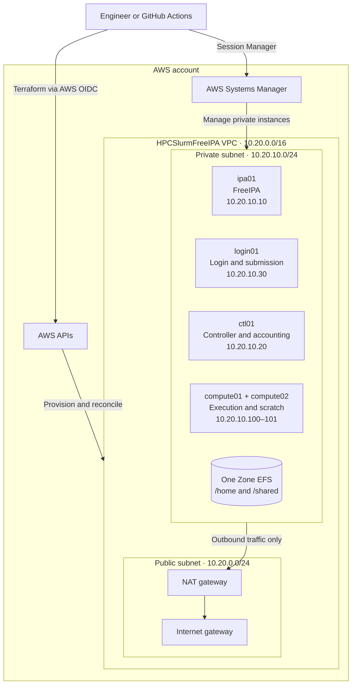
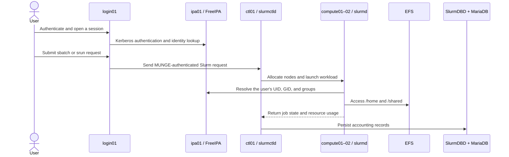

# AWS HPC Cluster Automation

Infrastructure as Code for a private, identity-aware Slurm cluster on AWS.
Terraform builds the cloud foundation, Ansible configures the operating system
and cluster services, FreeIPA provides centralized Linux identity, and MUNGE
secures communication between Slurm components.

The environment is intentionally compact—one identity server, one controller,
one login node, and two compute nodes—so it can demonstrate production-minded
HPC patterns without the cost of a large permanent cluster.

## What this project demonstrates

- Private EC2 nodes with no public IP addresses or inbound SSH
- Administration through AWS Systems Manager Session Manager
- Tag-driven dynamic Ansible inventory over the SSM connection plugin
- Centralized users, groups, sudo policy, Kerberos, LDAP, DNS, and SSSD
- Shared `/home` and `/shared` filesystems backed by encrypted Amazon EFS
- Encrypted gp3 scratch storage mounted independently on each compute node
- Shared MUNGE authentication with key material delivered from Secrets Manager
- Controller-local MariaDB prepared for SlurmDBD accounting
- Separate persistent and disposable Terraform state boundaries
- Least-privilege IAM and an OIDC-ready GitHub Actions deployment model

## Technology stack

| Layer                | Technologies                                                      |
| -------------------- | ----------------------------------------------------------------- |
| Cloud platform       | AWS EC2, VPC, IAM, EFS, EBS, S3, Systems Manager, Secrets Manager |
| Infrastructure       | Terraform, AWS provider, remote S3 state and locking              |
| Configuration        | Ansible, `amazon.aws`, `ansible.posix`, `ansible.mysql`           |
| Operating system     | Rocky Linux 9, systemd, Chrony, XFS                               |
| Identity             | FreeIPA, Kerberos, LDAP, DNS, SSSD                                |
| Scheduling and trust | Slurm, SlurmDBD, MUNGE                                            |
| Accounting           | MariaDB with InnoDB                                               |
| Delivery model       | GitHub Actions with AWS OIDC                                      |

## Architecture

### Deployment topology

The deployment view deliberately shows only infrastructure and management
boundaries. Service traffic is shown separately below so that operational and
runtime paths do not overlap.



### Workload and identity flow



### Node roles

| Node        | Responsibility                 | Default size | Primary services                      |
| ----------- | ------------------------------ | ------------ | ------------------------------------- |
| `ipa01`     | Identity and DNS               | `t3.medium`  | FreeIPA, Kerberos, LDAP, DNS, CA      |
| `ctl01`     | Scheduling and accounting      | `t3.medium`  | `slurmctld`, SlurmDBD, MariaDB, MUNGE |
| `login01`   | User access and job submission | `t3.small`   | SSSD, MUNGE, Slurm client tools       |
| `compute01` | Workload execution             | `t3.small`   | `slurmd`, MUNGE, local XFS scratch    |
| `compute02` | Workload execution             | `t3.small`   | `slurmd`, MUNGE, local XFS scratch    |

### Network policy

Security groups authorize traffic by workload role rather than by broad CIDR
rules. The shared cluster-client group is attached only to nodes that need
FreeIPA, Slurm, or EFS services.

| Destination   | Authorized source | Ports           | Purpose                           |
| ------------- | ----------------- | --------------- | --------------------------------- |
| FreeIPA       | Cluster clients   | TCP/UDP 53      | Integrated DNS                    |
| FreeIPA       | Cluster clients   | TCP 80, 443     | Enrollment, API, and web services |
| FreeIPA       | Cluster clients   | TCP/UDP 88      | Kerberos authentication           |
| FreeIPA       | Cluster clients   | TCP 389, 636    | LDAP and LDAPS                    |
| FreeIPA       | Cluster clients   | TCP/UDP 464     | Kerberos password service         |
| Controller    | Cluster clients   | TCP 6817        | Slurm controller RPC              |
| Compute nodes | Controller        | TCP 6818        | `slurmd` control traffic          |
| Controller    | Cluster clients   | TCP 6819        | SlurmDBD accounting RPC           |
| Login node    | Compute nodes     | TCP 60001–60010 | Interactive `srun` return traffic |
| EFS           | Cluster clients   | TCP 2049        | NFSv4.1 mounts                    |

MariaDB listens only on controller loopback and is not exposed through an AWS
security-group rule. No node accepts internet-facing SSH.

## Design decisions

### Private administration

All EC2 instances live in the private subnet. Session Manager replaces inbound
SSH, while the NAT gateway provides controlled outbound access for operating
system packages and AWS service endpoints. The Ansible inventory discovers
running instances from Terraform-managed EC2 tags and connects through SSM.

### Identity and Slurm authentication

FreeIPA and MUNGE solve different trust problems:

- FreeIPA supplies human identity, POSIX attributes, group membership, sudo
  policy, Kerberos authentication, LDAP, DNS, and SSSD integration.
- MUNGE signs credentials exchanged by Slurm components. Every Slurm node uses
  the same protected key, retrieved through its own EC2 instance role.

Maintaining consistent UIDs and GIDs across login, controller, and compute
nodes allows Slurm to launch workloads under the correct user identity.

### Storage model

| Storage                    | Scope            | Mount      | Purpose                                     |
| -------------------------- | ---------------- | ---------- | ------------------------------------------- |
| Encrypted EFS access point | Cluster-wide     | `/home`    | Shared FreeIPA home directories             |
| Encrypted EFS access point | Cluster-wide     | `/shared`  | Applications, data, scripts, and job output |
| Encrypted gp3 root EBS     | Per node         | `/`        | Operating system and services               |
| Encrypted gp3 scratch EBS  | Per compute node | `/scratch` | Temporary high-throughput job data          |

Compute disks are selected by EBS volume identity rather than assumed Linux
device names. Ansible formats only blank disks, mounts XFS by UUID, and refuses
devices containing unexpected filesystem, RAID, or partition signatures.

### Terraform state boundaries

| Root                 | Lifecycle  | Responsibility                                                                |
| -------------------- | ---------- | ----------------------------------------------------------------------------- |
| `terraform/identity` | Persistent | EC2 roles, instance profiles, secret containers, and GitHub OIDC permissions  |
| `terraform`          | Disposable | Network, EC2, EFS, EBS, security groups, NAT, and the Ansible transfer bucket |

This separation allows the lab infrastructure to be destroyed for cost control
without removing long-lived identities, secret containers, or deployment
permissions.

## Automation workflow

### Terraform provisioning

The persistent identity root is applied first. It establishes EC2 roles and
instance profiles, Secrets Manager containers, and the short-lived GitHub OIDC
deployment role. The disposable root reads those persistent outputs and creates
the VPC, subnets, NAT gateway, security groups, EC2 instances, EFS access
points, compute scratch volumes, and the temporary Ansible transfer bucket.

Every managed EC2 instance receives consistent discovery tags:

| Tag              | Example           | Use                                             |
| ---------------- | ----------------- | ----------------------------------------------- |
| `Project`        | `HPCSlurmFreeIPA` | Restricts inventory discovery to this project   |
| `ManagedBy`      | `terraform`       | Distinguishes Terraform-managed instances       |
| `AnsibleManaged` | `true`            | Opts the instance into configuration management |
| `Role`           | `controller`      | Creates the primary Ansible inventory group     |
| `NodeName`       | `ctl01`           | Supplies the inventory hostname and final FQDN  |

Terraform also exports the S3 transfer-bucket name and EFS identifiers needed
at Ansible runtime. These values are infrastructure metadata, not secrets.

### Dynamic inventory and SSM transport

The `amazon.aws.aws_ec2` inventory plugin discovers running instances and
builds the following groups without a static host file:

- `freeipa`, `controller`, `login`, and `compute` from the EC2 `Role` tag
- `freeipa_clients` from controller, login, and compute nodes
- `slurm_nodes` from controller, login, and compute nodes

Each inventory hostname maps to its EC2 instance ID. Ansible uses
`amazon.aws.aws_ssm` instead of SSH and transfers modules through a dedicated,
encrypted S3 bucket. Transfer objects expire automatically after one day, and
the bucket is deleted with the disposable stack.

### Configuration order

The main playbook deliberately configures dependencies before their consumers:

1. Apply the Rocky Linux baseline, hostname, time synchronization, and shared
   utilities to every node.
2. Install FreeIPA and create centralized groups, users, and sudo policy.
3. Enroll controller, login, and compute nodes as FreeIPA clients.
4. Mount the EFS access points and prepare compute-local scratch storage.
5. Install the shared MUNGE trust domain on all Slurm nodes.
6. Prepare MariaDB before starting SlurmDBD and `slurmctld` on the controller.
7. Configure Slurm client tools on the login node and `slurmd` on compute nodes.

This sequencing prevents Slurm services from starting before DNS, identity,
clock synchronization, shared authentication, and accounting storage are ready.

## Service configuration

### Operating-system baseline

The common role standardizes Rocky Linux 9 nodes before application services
are installed. It configures UTC, assigns each Terraform `NodeName` as a
cluster FQDN, installs shared administration tools, and points Chrony at the
Amazon Time Sync Service (`169.254.169.123`). Temporary managed `/etc/hosts`
entries support deterministic bootstrap resolution before FreeIPA DNS is fully
available.

### FreeIPA server and identities

`ipa01.cluster.internal` provides the `CLUSTER.INTERNAL` Kerberos realm and
integrated DNS. The server is installed non-interactively with credentials
retrieved locally from Secrets Manager. External DNS requests are forwarded to
the VPC resolver.

The identity role creates two demonstration access levels:

| Identity   | Membership                | Intended access                    |
| ---------- | ------------------------- | ---------------------------------- |
| `hpcuser`  | `hpc_users`               | Standard cluster user              |
| `hpcadmin` | `hpc_users`, `hpc_admins` | Cluster user with centralized sudo |

Administrative operations use an isolated temporary Kerberos credential cache
that is destroyed on both success and failure. Initial user passwords are set
out of band and are never committed to the repository.

### FreeIPA clients

Controller, login, and compute nodes configure FreeIPA DNS with the VPC resolver
as a fallback, install SSSD and automatic home-directory support, and enroll
non-interactively. One-time enrollment passwords are created on `ipa01`, so the
FreeIPA administrator credential is never granted to client instance roles.

### Shared and local storage

The storage-client role mounts encrypted EFS access points persistently with
TLS. `/shared` is owned by `root:hpc_users` with setgid permissions so new files
inherit the collaboration group.

For `/scratch`, Ansible correlates Terraform's EBS volume ID with the NVMe
serial presented by EC2. It does not assume that `/dev/sdf` remains the Linux
device name. A disk is formatted only when it is blank; existing unexpected
signatures cause the role to stop rather than overwrite data.

### MUNGE trust domain

The MUNGE role installs the service on the controller, login, and compute
nodes. Each host retrieves the same base64-encoded key using its instance role,
decodes it into a protected temporary file, and atomically replaces
`/etc/munge/munge.key` only when the content changes. The key is owned by
`munge:munge` with mode `0600`, and a change triggers a controlled service
restart.

The role performs a local encode/decode test; the validation playbook separately
proves that a controller-generated credential can be decoded across the Slurm
node group.

### MariaDB accounting storage

MariaDB runs only on `ctl01` and binds to `127.0.0.1`. A dedicated configuration
fragment applies a case-insensitive UTF-8 collation and lab-sized InnoDB tuning,
including a 512 MiB buffer pool, 128 MiB log file, 900-second lock timeout, and
16 MiB maximum packet size.

The controller retrieves the database secret through its instance role. Ansible
creates the accounting database and a `localhost` application user with full
privileges only on that database. Administrative operations use MariaDB's local
Unix socket; no database-root password or remote database administration path
is introduced.

## Secret handling

Terraform creates secret containers but never stores secret values in state.
FreeIPA credentials, the MUNGE key, and MariaDB credentials are populated
outside Terraform and retrieved locally by the authorized EC2 instance role.
Sensitive Ansible operations suppress their output with `no_log`.

Required Secrets Manager names:

```text
HPCSlurmFreeIPA/freeipa/credentials
HPCSlurmFreeIPA/slurm/munge
HPCSlurmFreeIPA/slurm/database
```

Expected JSON values:

```json
{"admin_password": "...", "directory_manager_password": "..."}
```

```json
{"munge_key_base64": "..."}
```

```json
{"database_name": "slurm_acct_db", "username": "slurm", "password": "..."}
```

Secret access is limited by node role:

| EC2 role   | Readable secrets                         |
| ---------- | ---------------------------------------- |
| FreeIPA    | FreeIPA bootstrap credentials            |
| Controller | MUNGE key and Slurm database credentials |
| Login      | MUNGE key                                |
| Compute    | MUNGE key                                |

The expected JSON schemas and rotation considerations are documented in
[`ansible/README.md`](ansible/README.md).

## Repository layout

```text
.
├── terraform/
│   ├── identity/              # Persistent IAM, OIDC, and secret metadata
│   └── modules/               # Network, compute, storage, IAM, and security
├── ansible/
│   ├── inventory/             # Dynamic EC2 inventory over SSM
│   ├── group_vars/            # Cluster and node-role variables
│   ├── playbooks/             # Configuration and runtime validation
│   └── roles/                 # Identity, storage, MUNGE, MariaDB, and Slurm
├── ARCHITECTURE.md            # Architecture decisions and rationale
└── README.md
```

Supporting documentation:

- [Terraform infrastructure](terraform/README.md)
- [Persistent identity stack](terraform/identity/README.md)
- [Ansible configuration](ansible/README.md)

## Deployment

### Prerequisites

- Terraform `>= 1.10.0, < 2.0.0`
- AWS provider `~> 6.61`
- Ansible Core and the collections declared under `ansible/`
- AWS CLI and the Session Manager plugin
- An encrypted S3 backend and an existing GitHub Actions OIDC provider
- Access to `us-east-1` with sufficient EC2, EBS, EFS, and VPC quotas

### 1. Provision persistent identity resources

```bash
cp terraform/identity/terraform.tfvars.example terraform/identity/terraform.tfvars
terraform -chdir=terraform/identity init -reconfigure
terraform -chdir=terraform/identity fmt -check -recursive
terraform -chdir=terraform/identity validate
terraform -chdir=terraform/identity plan -out=identity.tfplan
terraform -chdir=terraform/identity apply identity.tfplan
```

Populate the three Secrets Manager containers after this step. Never place
plaintext credentials in Terraform variables, `.tfvars`, workflow YAML, or Git.

### 2. Provision the disposable cluster

```bash
cp terraform/terraform.tfvars.example terraform/terraform.tfvars
terraform -chdir=terraform init -reconfigure
terraform -chdir=terraform fmt -check -recursive
terraform -chdir=terraform validate
terraform -chdir=terraform plan -out=cluster.tfplan
terraform -chdir=terraform apply cluster.tfplan
```

### 3. Confirm private-node management

Wait until all five instances are registered with Systems Manager before
running Ansible:

```bash
aws ssm describe-instance-information \
  --region us-east-1 \
  --query 'InstanceInformationList[*].[InstanceId,PingStatus,PlatformName]' \
  --output table
```

Each expected node must report `Online`. This is the management-plane readiness
gate for a cluster with no SSH entry point.

### 4. Configure the nodes

Install the Ansible dependencies and obtain the Terraform outputs required by
the SSM connection and EFS roles:

```bash
python3 -m pip install -r ansible/requirements.txt
ansible-galaxy collection install -r ansible/requirements.yml

ANSIBLE_TRANSFER_BUCKET="$(
  terraform -chdir=terraform output -raw ansible_transfer_bucket_name
)"
EFS_FILE_SYSTEM_ID="$(
  terraform -chdir=terraform output -raw efs_file_system_id
)"
EFS_HOME_ACCESS_POINT_ID="$(
  terraform -chdir=terraform output -raw efs_home_access_point_id
)"
EFS_SHARED_ACCESS_POINT_ID="$(
  terraform -chdir=terraform output -raw efs_shared_access_point_id
)"

cd ansible
ansible-inventory --graph
ansible-playbook \
  -e "ansible_aws_ssm_bucket_name=${ANSIBLE_TRANSFER_BUCKET}" \
  -e "efs_file_system_id=${EFS_FILE_SYSTEM_ID}" \
  -e "efs_home_access_point_id=${EFS_HOME_ACCESS_POINT_ID}" \
  -e "efs_shared_access_point_id=${EFS_SHARED_ACCESS_POINT_ID}" \
  playbooks/site.yml
```

## Validation

Validation is split into static checks, configuration idempotency, and runtime
service checks:

| Layer           | Verification                                        | What it proves                                                     |
| --------------- | --------------------------------------------------- | ------------------------------------------------------------------ |
| Terraform       | Formatting and validation for both roots            | HCL is normalized and provider configuration is internally valid   |
| Ansible         | Syntax checks for `site.yml` and `validate.yml`     | Inventory expressions, roles, and module arguments parse correctly |
| Idempotency     | A second `site.yml` execution                       | Stable resources converge without repeated changes                 |
| Scratch storage | Active XFS mount, UUID persistence, and mode `1777` | Compute-local storage is safe and survives reboot                  |
| MUNGE           | Controller token decoded across Slurm nodes         | Nodes share the key and can authenticate credentials               |
| MariaDB         | Application login and loopback binding              | SlurmDBD credentials work without exposing port 3306               |

Run the static checks before provisioning or submitting a pull request:

```bash
terraform -chdir=terraform fmt -check -recursive
terraform -chdir=terraform validate
terraform -chdir=terraform/identity fmt -check -recursive
terraform -chdir=terraform/identity validate

cd ansible
ansible-playbook --syntax-check playbooks/site.yml
ansible-playbook --syntax-check playbooks/validate.yml
```

After deployment, the read-only validation playbook checks compute scratch
storage, cross-node MUNGE authentication, and MariaDB access:

```bash
ansible-playbook \
  -e "ansible_aws_ssm_bucket_name=${ANSIBLE_TRANSFER_BUCKET}" \
  playbooks/validate.yml
```

Run `site.yml` twice after the initial deployment. The second run should report
no changes for stable resources.

When the Slurm roles are complete, runtime acceptance will additionally verify
that both compute nodes reach `IDLE`, a FreeIPA user can complete a multi-node
job, and `sacct` returns the persisted accounting record.

## CI/CD design

The repository is structured for three GitHub Actions workflows authenticated
through short-lived AWS OIDC credentials:

| Workflow responsibility  | Trigger                     | Stages                                                                                    |
| ------------------------ | --------------------------- | ----------------------------------------------------------------------------------------- |
| Continuous integration   | Pull request and push       | Terraform formatting/validation, Ansible syntax, and linting                              |
| Reviewed deployment      | Manual environment approval | OIDC login, identity apply, cluster apply, SSM readiness, Ansible, and runtime validation |
| Cost-controlled teardown | Manual environment approval | Destroy the disposable Terraform root while preserving identity resources                 |

The IAM trust policy restricts role assumption to the configured repository
subject and the `sts.amazonaws.com` audience. Workflow files remain a delivery
integration task; the infrastructure is already divided so deployment and
teardown can use different approval and permission boundaries.

## Current project state

Terraform infrastructure and the Ansible roles for the base operating system,
FreeIPA, centralized identities, EFS, compute scratch, MUNGE, and MariaDB are
implemented and pass local syntax validation. SlurmDBD and the Slurm controller,
login, and compute roles remain in development. Runtime validation against the
deployed AWS environment is still pending.

The intended end-to-end acceptance test is a FreeIPA user submitting a
multi-node job from `login01`, executing across both compute nodes, writing
output to `/shared`, and retrieving the completed accounting record with
`sacct`.

## Teardown and cost control

Destroy the disposable root when the lab is not in use:

```bash
terraform -chdir=terraform plan -destroy -out=destroy.tfplan
terraform -chdir=terraform apply destroy.tfplan
```

The disposable teardown removes the VPC, NAT gateway, EC2 instances, EFS, and
EBS volumes. The persistent identity root and Terraform backend remain.

The primary cost drivers are NAT gateway uptime, EC2 running hours, EBS
storage, EFS data, and Secrets Manager containers. Stopping EC2 instances does
not eliminate those charges.
